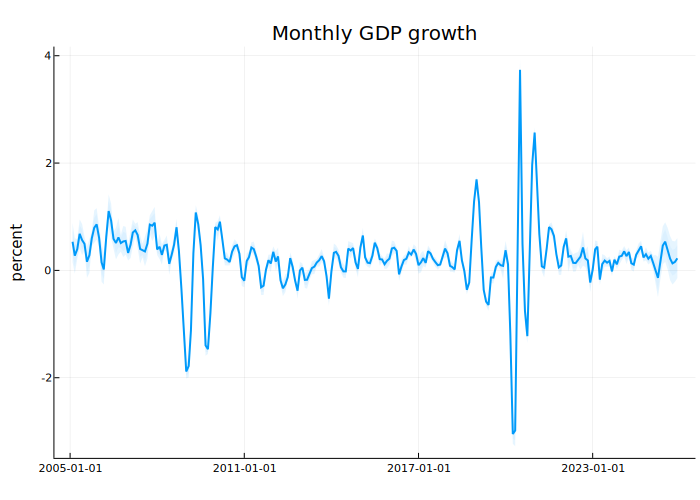
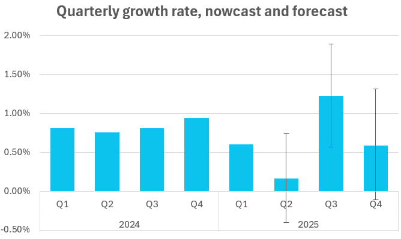

Since joining the RWI in 2016 I have been responsible for forecasting and nowcasting the euro area countries. To this aim I have set up a variety of state-of-the-art methods that we have been using both internally and externally. For example, I oversee our Mixed-frequency VAR model for German GDP (quarterly data disaggregated into monthly), as well as our model for the state of Northrheine-Westfalia (yearly data disaggregated into quarterly), both of which, we publish regularly in our forecasts.

I've always wanted to implement those models for Bulgaria, and with joining the Euro in 2026, I think that there is no better time to do so.

I have recently implemented the mixed-frequency method of [Joshua Chan, Aubrey Poon, and Dan Zhu (2023), High-dimensional conditionally Gaussian state space models with missing data](https://www.sciencedirect.com/science/article/pii/S0304407623001628?via%3Dihub) in Julia and Matlab with a hierarchical Minnesota based prior with and without stochastic volatility. 

I am presenting here the homoskedastic version, estiamted with growth rates.

## Data

The data in the model is in quarterly growth rates and starts in 2005.

| **Variable**      | **Abbreviation** | **Transformation** | **Source** |
|----------------------------|---------------------------|-----------------------------|---------------------|
| HICP headline              | hicpBG                    | SA, in growth rates         | Eurostat            |
| Employment (total)         | empBG                     | SA, in growth rates         | Eurostat            |
| ESI Industry               | survIndustryBG            | div(100)                    | NSI                 |
| ESI Retail                 | survRetailBG              | div(100)                    | NSI                 |
| ESI Services               | survServiceBG             | div(100)                    | NSI                 |
| Producer price index       | ppiBG                     | SA, in growth rates         | Eurostat            |
| Real domestic retail trade | retailBG                  | SA, in growth rates         | Eurostat            |
| Imports                    |                           | SA, in growth rates         | Eurostat            |
| Exports                    |                           | SA, in growth rates         | Eurostat            |
| Industrial production      |                           | SA, in growth rates         | Eurostat            |
| Production in construction | constBG                   | SA, in growth rates         | Eurostat            |
| Tourist arrivals           | arrivalsBG                | SA, in growth rates         | Eurostat            |
| SOFIX                      |                           | SA, in growth rates         | Eurostat            |
| GDP                        |                           | SA, in growth rates         | Eurostat            |

The currently available high frequency indicators for Q2 in the beginning of July are mostly surveys, financial data and prices. From the hard indicators we have industrial prodcution, construction, and retail for April, as well as tourist data for April and May.

Here is how the "ragged edge" of the data looks like


For the second quarter, the nowcast estimate suggests a slowdown of Bulgarian GDP growth to 0.15 after the 0.6% quarter-on-quarter growth rate in Q1 of 2025. The forecast for the remainder of the year are a strong 1.2% growth in Q3 and a moderate 0.6% for Q4.

I plan to publish regularly these nowcasts, as well as compile a paper with the model and comparison of the out-of-sample forecast performance of the model for various speicifications (with and without stochastic volatilty). If you want, you can download the monthly series ([BGMFVAR_250703.xlsx](xlsx), [BGMFVAR_250703.csv](csv)) and if you are interested, feel free to write me an [@boris.blagov@rwi-essen.de](email).
