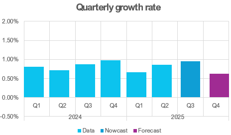

The current nowcast for Q3 for Bulgaria sits at a bit below 1% and the forecast for Q4 is at 0.6% growth rate. It includes the latest GDP Eurostat publication for Q2 from the 06.09.2025 and monthly data up to 11th of September (I know, I know, I am sitting on these numbers for a while). Nevertheless I hope it can be of use for forecasters and the September [Macroeconomic Forecast](BGMFVAR_250911.xlsx) round, although it is probably a bit too late for that.

You can download the monthly GDP series with 68% and 95% quantiles ([xlsx](BGMFVAR_250911.xlsx) and if you are interested in other details, do get in touch via [email](mailto:boris.blagov@rwi-essen.de).

