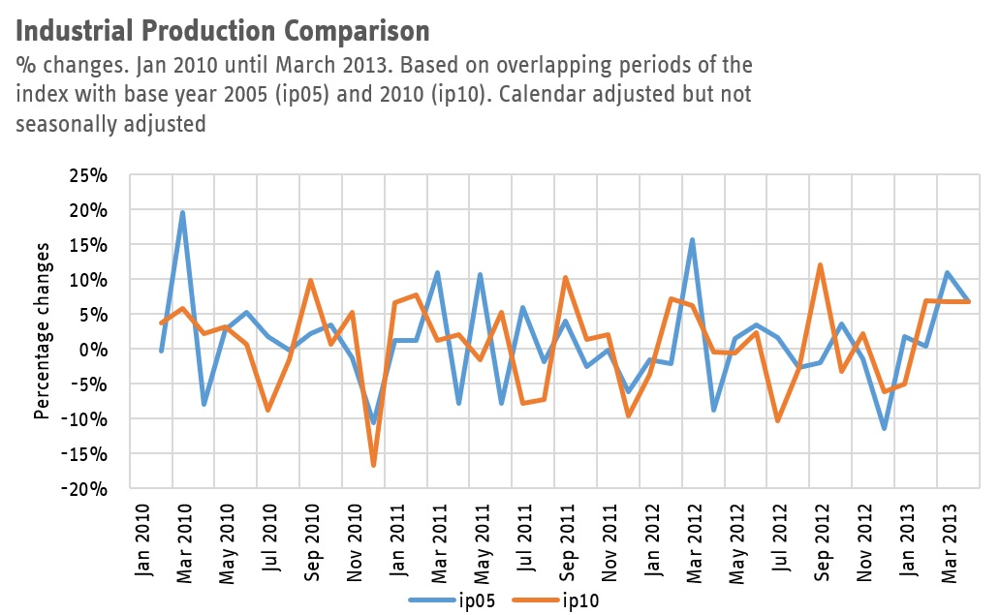

The data office IT.NRW does not publish a long time series for industrial production for NRW. [See here at the Landesdatenbank IT.NRW](https://landesdatenbank.nrw.de/ldbnrw/online?operation=statistic&levelindex=0&levelid=1778586333691&code=42153#abreadcrumb)

They offer the index for a period of maximum 7 years and 2 months: 
- ip05: From 2005 to 2013 with base year 2005, unadjusted and calendar adjusted (code 42153-10i)
- ip10: From 2010 to 2018 with base year 2010, unadjusted and calendar adjusted (code 42153-07i)
- ip15: From 2015 to 2023 with base year 2015, unadjusted, calendar adjusted, and seasonally and calendar adjusted. Note that the website says only seasonally adjusted! (code 42153-04i)
- ip21: From 2021 to 2026 with base year 2015, unadjusted, calendar adjusted, and seasonally and calendar adjusted. Note that the website says only seasonally adjusted! (code 42153-01i)

There also exists an index with a base year 2000 (from 2000 to 2008), but that index is based on the 2003 system of national accounts (WZ 2003, not WZ 2008 as the rest). Therefore here we do not extend the index prior to 2005.

For working with econometric models, however, it is advantegous to have longer historical data. Here, 
I am presenting an index that is available monthly from 2005 and is currently up to the 2026 February vintage and am detailing how this index is constructed.

## Weight adjustment
These four indices have their weights varying, meaning that the overlapping periods do not have the same dynamics. E.g. if you take the 2005 index and look the years 2010-2013 and compare it to the 2010 index for the years 2010-2013, the dynamic (meaning the percentage changes, aka growth rates) are starkly different as evident from the following picture.

Therefore any splicing of different base years will not only have re-basing but also varying weights. For 2005-2010 we consider the data with the weights from the index with base year 2005, for 2010 to 2015 we consider the weights from the index from 2010 and so on.

## Seasonal adjustment of 2005 and 2010 indices
The indices for base year 2005 and 2010 unfortunately are not available with the state's seasonal adjustment. Therefore we do the following:
1. Take ip05, the index with the base year 2005. Calculate the monthly percentage changes. 
2. Take ip10, the index with the base year 2010. Starting from the value for January 2010 calculate a fictional December 2009 value using the growth rate of Dec '09 to Jan '10 from the ip05 index from (1.) Repeat backwards until January 2005. The new fictional index has the dynamics of ip05 for the period Jan '05 to Dec '09 and the dynamics (and level) of the ip10 index and has a base year of 2010.
3. This new index (ip_5_10) is then seasonally adjusted using the X13 Arima procedure with the Gretl software.

## Combining the 2015 and 2021 indices

Since from 2015 onwards the indices do have seasonally (sa) and calendar adjusted (ca) data we "splice" them together. Note that due to the varying weights we cannot compare levels, e.g. we cannot simply combine the two time series in levels. Therefore we follow the scheme from the 2005-2010 indices without the seasonal adjustment step. That is:
1. Take the ip15 index (sa and ca) and calculate its month on month growth rates.
2. Take the ip21 index (sa and ca) and using the January 2021 value calculate a fictional December 2020 value using the growth rate from the ip15 index. Proceed to do so backwards to create a history for the index before 2021 (ip_15_21).

## Combining the 2005-2010 and the 2015-2021 indices

We combine the two indices in one long time series in the same way.
1. Take the ip_5_10 index (sa and ca) and calculate its month on month growth rates. Note that the index goes from January 2005 to 2014 December.
2. Take the ip_15_21 index (sa and ca) and using the January 2015 value calculate a fictional December 2020 value using the growth rate from the ip15 index. Proceed to do so backwards to create a history for the index before 2021.

## Updating

When IT.NRW release a new index, they only update the latest base year data - data backwards up to currently January 2021. The  index can be easily updated by replacing the data from 2021 onwards with the new data. Once the new 2025 base year is released I will update the index.

## Download

You can download the monthly Industrial Production NRW series ([are available in Excel format here](2026-05_42153_combined.xlsx). You can also see how they are caclulated in more detail. If you are interested in other details, do get in touch via [email](mailto:boris.blagov@rwi-essen.de).